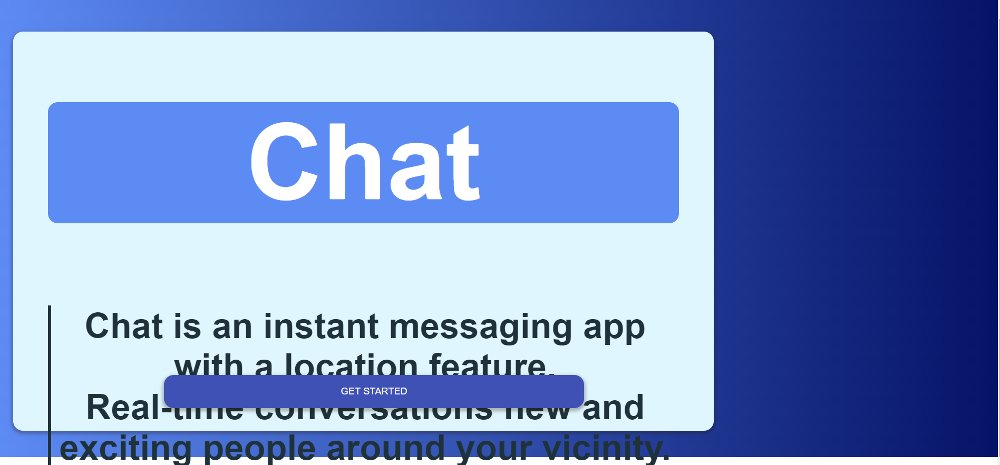

# Chat.io

✔️ Final portfolio.

Chat is an instant messaging app with a location feature.

It's built on a the MERN stack and utilizes the following tecnologies:
* Backend (Node.js)
    * Express.js
    * Redis
    * MongoDb
    * Socket.io
* Frontend
    * React.js
    * Material UI
    * Mantine


## Installation

To test the app locally please install the necessary packages for the root and client directory

#### root of the project
```bash
  npm install
```
#### client directory
```bash
  cd client
  npm install
```

Run ``` npm run build ``` from the client directory to build the project and lastly start the project using ```npm start``` from the root of the project


## Screenshots 





  